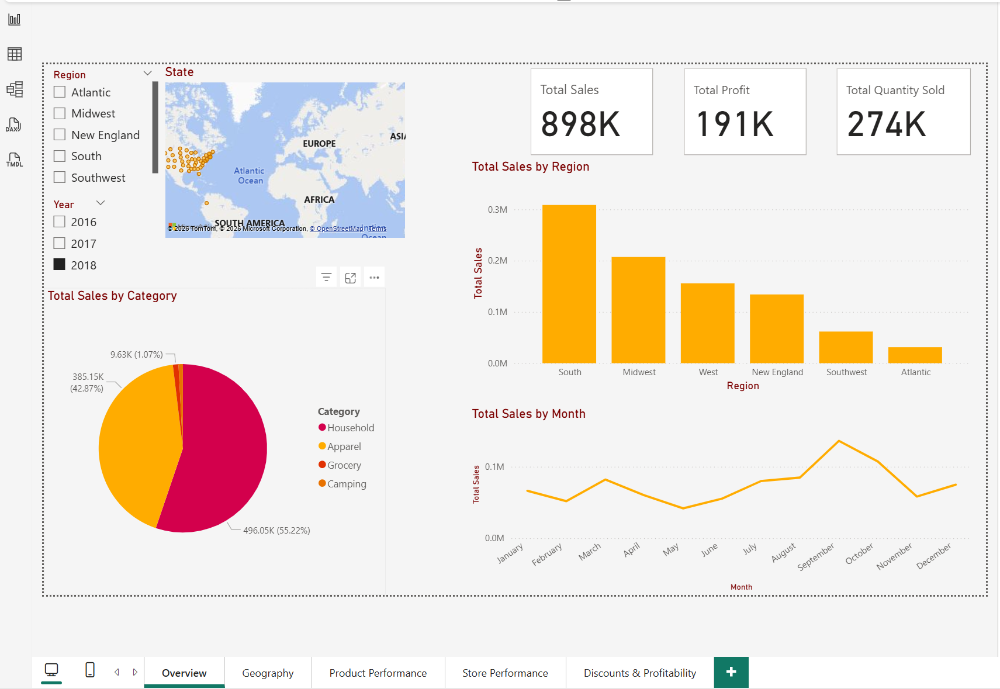
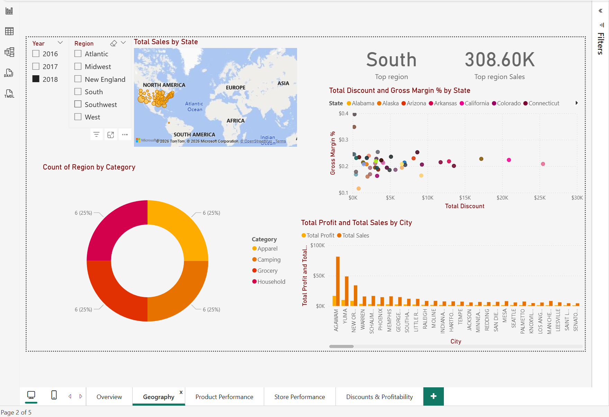
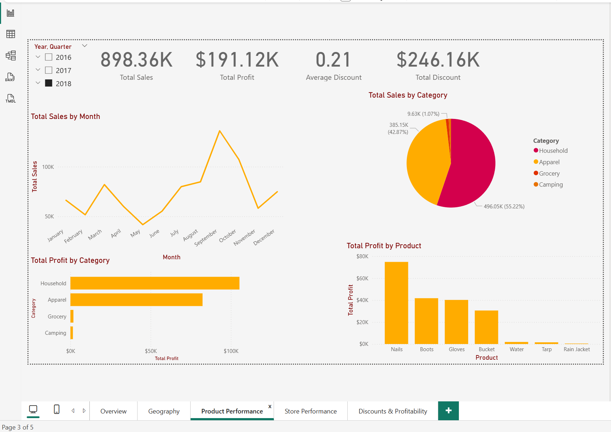
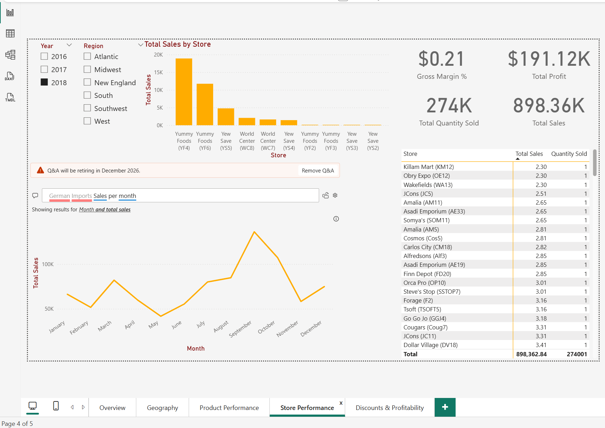
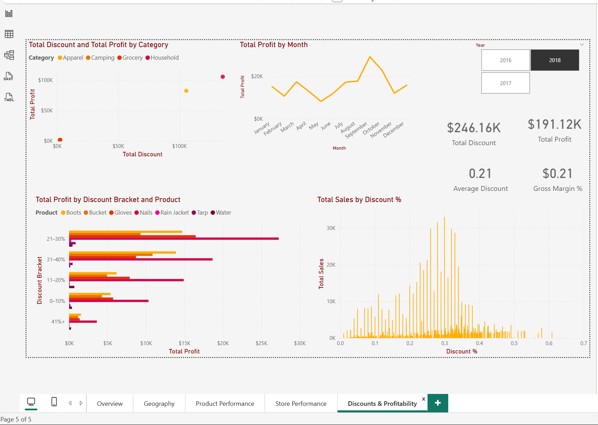

# Power BI Sales Dashboard — Retail Analytics

An interactive 5-page Power BI dashboard analyzing retail sales performance across multiple regions, stores, and product categories in the United States from 2016 to 2018. Built with DAX measures, dynamic slicers, and multi-page navigation to deliver actionable business insights.

---

## Project Overview

This dashboard was developed as part of a university data analytics project to explore how retail businesses can use Power BI to transform raw transactional data into meaningful insights. The report covers sales performance, geographic trends, product profitability, store-level performance, and the impact of discounts on overall profit margins.

Key Metrics at a Glance:
1.Total Sales: $898.36K
2.Total Profit:$191.12K
3.Total Quantity Sold:274K units
4.Average Discount:21%
5.Top Region: South ($308.60K)

---

## Tools & Skills Demonstrated

- **Power BI Desktop** — Report design, data modeling, and visualization
- **DAX (Data Analysis Expressions)** — Custom measures for KPIs, gross margin, and aggregations
- **Data Modeling** — Relationships between Region, State, and Transactions tables
- **Interactive Visualizations** — Maps, bar charts, line charts, pie/donut charts, scatter plots, histograms
- **Slicers & Filters** — Dynamic filtering by Year, Region, and State
- **Power BI Q&A** — Natural language queries
- **Multi-page Report Design** — Structured storytelling across 5 themed pages

---

## 📑 Dashboard Pages

### 1️⃣ Overview
A high-level summary of key performance indicators including total sales, profit, and quantity sold. Features a regional sales map, category breakdown, and monthly sales trend.

### 2️⃣ Geography
Geographic analysis showing the top-performing region (South), gross margin percentages by state, category distribution, and profit/sales breakdown by city.

### 3️⃣ Product Performance
Deep dive into product-level insights with sales by category, profit by category, monthly sales trends, and top-performing products (Nails, Boots, Gloves leading profit).

### 4️⃣ Store Performance
Store-level analysis showing top-performing stores (Yummy Foods, Yew Save), detailed store metrics table, and integrated Power BI Q&A for natural language exploration.

### 5️⃣ Discounts & Profitability
Analysis of discount strategies and their impact on profit, including discount bracket breakdowns, sales distribution by discount percentage, and category-level profit vs. discount relationships.

---

## Key Insights

- **South region dominates** with $308.60K in sales, followed by Midwest
- **Household category** leads with 55.22% of total sales ($496.05K)
- **Nails** is the most profitable single product, generating ~$75K in profit
- **21–30% discount bracket** drives the highest profit volume, suggesting an optimal discount range
- Sales peak in **September**, indicating potential seasonal demand patterns

---

## Repository Contents

| File | Description |
|------|-------------|
| `W5 Power BI(1).pbix` | Main Power BI report file |
| `W3 Uluru Goods.xlsx` | Sales transactions dataset |
| `Location(1).xlsx` | Store and location reference data |
| `01-overview.png` — `05-discounts-profitability.png` | Dashboard screenshots |

---

## How to View

1. **View the screenshots** above for a quick preview of the dashboard.
2. **To explore interactively:** Download the `.pbix` file and open it with [Power BI Desktop](https://powerbi.microsoft.com/desktop/) (free).
3. Make sure the Excel files are in the same folder as the `.pbix` file if you want to refresh the data.

---

## About Me

**Md Abdullah Al Amin**

Aspiring data analyst passionate about turning data into actionable insights using Power BI, Excel, and SQL.

Connect with me on [LinkedIn](https://www.linkedin.com/in/mdabdullah-amin)
---

⭐ *If you found this project helpful or interesting, please consider giving it a star!*
